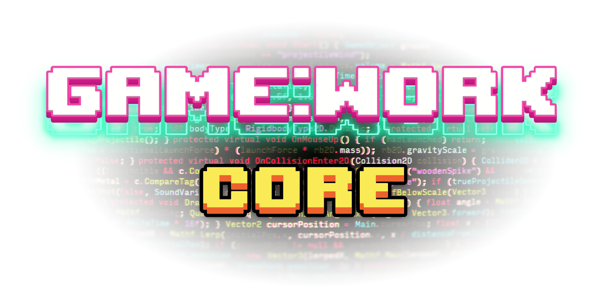

<p align="center"></p>

<p align="center"><b>A micro-kernel framework with dependency injection and event-driven communication.</b></p>

<br>
<p align="center">
  <a style="text-decoration:none">
    
  </a>  
  <a style="text-decoration:none">
    
  </a>
  <a style="text-decoration:none">
    
  </a>
</p>
<p align="center"><b>⚠️Still In Early Development ⚠️<b/></p>

## 🎇 Features

- Highly configurable micro-kernel architecture.
- Dependency management by Injection.
- Event-driven communication.

## 🔧 Requisites

- Unity 2021.2 or higher.
- [Game:Work Foundation](https://github.com/FronkonGames/GameWork-Foundation).
- Test Framework 1.1.31 or higher.

## ⚙️ Installation

### Editing your 'manifest.json'

- Open the manifest.json file of your Unity project.
- In the section "dependencies" add:

```
{
  ...
  "dependencies":
  {
    ...
    "FronkonGames.GameWork.Foundation": "git+https://github.com/FronkonGames/GameWork-Foundation.git",
    "FronkonGames.GameWork.Core": "git+https://github.com/FronkonGames/GameWork-Core.git"
  }
  ...
}
```

## 🚀 Use

The functionality is divided into folders, this is its structure:

```
|
|\_Runtime......................... Utilities for the game.
|   |\_Async....................... Custom async Awaiters.
|   |\_DI.......................... Dependency injection management.
|   |\_Events...................... Event-driven communication.
|   |\_Modules..................... Micro kernel architecture (aka plugin-based).
|    \_Test........................ Unit tests.
|
 \_Editor.......................... Editor utilities.
```

Check the comments for each file for more information.

## 📜 License

Code released under [MIT License](https://github.com/FronkonGames/GameWork-Core/blob/main/LICENSE.md).